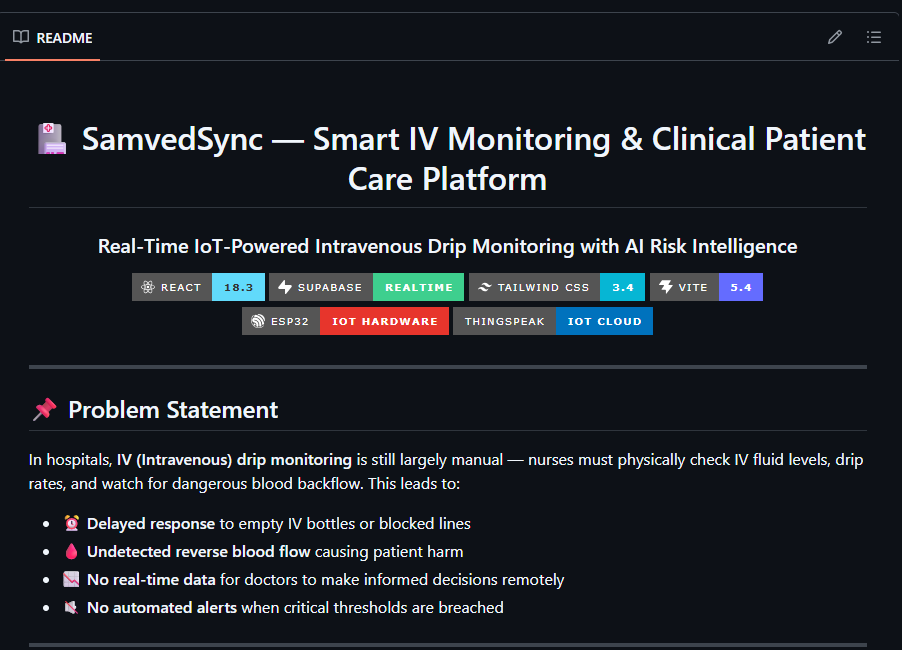

<div align="center">

# 🏥 SamvedSync — Smart IV Monitoring & Clinical Patient Care Platform

### Real-Time IoT-Powered Intravenous Drip Monitoring with AI Risk Intelligence

[](https://react.dev)
[](https://supabase.com)
[](https://tailwindcss.com)
[](https://vitejs.dev)
[](https://www.espressif.com)
[](https://thingspeak.com)

</div>

---

## 📌 Problem Statement

In hospitals, **IV (Intravenous) drip monitoring** is still largely manual — nurses must physically check IV fluid levels, drip rates, and watch for dangerous blood backflow. This leads to:

- ⏰ **Delayed response** to empty IV bottles or blocked lines
- 🩸 **Undetected reverse blood flow** causing patient harm
- 📉 **No real-time data** for doctors to make informed decisions remotely
- 🔇 **No automated alerts** when critical thresholds are breached

---

## 💡 Our Solution — SamvedSync

**SamvedSync** is a full-stack **Software + Hardware** platform that automates IV drip monitoring using IoT sensors and delivers real-time telemetry to role-based clinical dashboards.

### How It Works:

```
ESP32 + IR Sensor + Color Sensor
        │
        ▼
   ThingSpeak IoT Cloud
        │
        ▼
   Supabase Realtime Database
        │
        ▼
   SamvedSync Web Application
   (Doctor / Admin / Nurse Dashboards)
```

1. **Hardware (ESP32 Microcontroller)** — IR optical sensor counts IV drops per minute. Color sensor detects blood backflow in the IV line.
2. **ThingSpeak IoT Cloud** — Sensor readings are pushed to ThingSpeak channels via HTTP every few seconds.
3. **Supabase Realtime DB** — Patient records, alerts, and staff data are synced in real-time.
4. **SamvedSync Web App** — React-based dashboards display live telemetry, alerts, and AI-powered risk analysis.

---

## 🖥️ Screenshots

<!-- Add your screenshots to the /screenshots folder and uncomment below -->
<!-- 
| Landing Page | Login Page |
|:---:|:---:|
|  |  |

| Doctor Dashboard | Admin Dashboard |
|:---:|:---:|
|  |  |

| Nurse Dashboard | Patient Live Telemetry |
|:---:|:---:|
|  |  |

| AI Medical Chatbot | AI What-If Risk Simulator |
|:---:|:---:|
|  |  |

| Messages | Nurse Verification |
|:---:|:---:|
|  |  |

| Reports | Hardware Setup |
|:---:|:---:|
|  |  |
-->

---

## ✨ Key Features

### 🩺 Role-Based Clinical Dashboards
| Role | Capabilities |
|------|-------------|
| **Doctor** | View all patients, live IV telemetry, approve/reject nurse registrations, send directives, export reports |
| **Admin** | Full CRUD for patients & nurses, bind ThingSpeak hardware channels, manage hospital staff |
| **Nurse** | Monitor assigned patients, live drip rate history graph, acknowledge alerts, staff messaging |

### 📡 Real-Time IV Monitoring
- **Live Drip Rate** (gtt/min) — counted by IR optical sensor
- **IV Fluid Level** (%) — estimated from drip volume over time
- **Blood Backflow Detection** — color sensor identifies blood climbing back up the IV tube
- **Drip Rate History Telemetry Graph** — interactive SVG chart for patient detail view

### 🔐 Dual-Verification Nurse Security
- New nurses self-register via the **Nurse Join** form on the login page
- Account created in **Pending** status
- Hospital Admin or Doctor must **Approve** or **Reject** from the **Nurse Verification** tab
- Prevents unauthorized access to patient data

### 🤖 AI Medical Assistant Chatbot
- **100% Instant Rule-Based Engine** — zero API dependency, works offline
- **Typo-Tolerant** — handles `suger → sugar`, `bolld → blood`, `canser → cancer`, etc.
- **Clinical Knowledge**: Normal blood sugar, low sugar protocols (15-15 Rule), cancer symptoms (CAUTION acronym), heart attack guidelines, asthma management, fever protocols
- **Dynamic IV Drop Rate Calculator** — parses natural language like *"Calculate drop rate for 500 mL over 4 hours with 15 drop factor"* and shows step-by-step math

### 🧠 AI What-If Risk Simulator
- **Interactive Sliders**: IV Fluid Level %, Drip Rate (gtt/min), Prescribed Rate (mL/hr), Drop Factor, Blood Backflow Toggle, Patient Age, ICU Ward
- **AI Composite Risk Score** (0–100) with animated circular gauge (Green → Yellow → Red)
- **Predicted Time-to-Depletion** — estimated minutes until IV bottle empties
- **Infiltration Risk Probability** (%) — logistic regression model
- **Preset Scenario Buttons**: Normal Infusion, Low Fluid 12%, Reverse Flow Crisis
- **Clinical AI Directives** — actionable recommendations based on simulated parameters

### 💬 Staff Communication System
- **Direct Messaging** between Doctors, Admins, and Nurses
- **Message Nurse** button on patient cards for urgent directives
- **Header Notification Bell** with real-time red badge counter
- **Popup Alerts** for critical IV events (drip stop, backflow detected)

### 📊 Reports & Data Export
- **CSV Export** — download patient telemetry readings as spreadsheet
- **PDF Export** — printable patient reports for shift handovers
- Patient data table preview before export

---

## 🛠️ Tech Stack

### Software
| Technology | Purpose |
|-----------|---------|
| **React 18** | Frontend UI framework |
| **Tailwind CSS 3.4** | Utility-first styling |
| **Vite 5** | Build tool & dev server |
| **Supabase** | Realtime PostgreSQL database, authentication, Row Level Security |
| **React Router v6** | Client-side routing |
| **Framer Motion** | UI animations & transitions |
| **Lucide React** | Icon library |

### Hardware
| Component | Purpose |
|-----------|---------|
| **ESP32** | WiFi-enabled microcontroller |
| **IR Optical Sensor** | Counts IV drops per minute |
| **Color Sensor (TCS3200)** | Detects blood backflow in IV line |
| **ThingSpeak IoT Cloud** | Stores & serves sensor telemetry via REST API |

### AI/ML
| Feature | Method |
|---------|--------|
| **Risk Score Engine** | Weighted heuristic rules + composite scoring (0–100) |
| **Time-to-Depletion** | Fluid dynamics formula: T = (Volume × DropFactor) / DripRate |
| **Infiltration Probability** | Logistic Regression: P = 1 / (1 + e^(-(−3.2 + 0.03·Rate + 2.5·Backflow + 0.8·Elderly))) |
| **AI Chatbot** | Pattern matching + typo normalization + rule-based clinical knowledge |

---

## 📁 Project Structure

```
SamvedSync_Supabase_v4/
├── app/                          # React Frontend Application
│   ├── public/
│   │   ├── chatbot-logo.jpg      # AI Chatbot avatar image
│   │   └── _redirects            # Netlify SPA routing
│   ├── src/
│   │   ├── components/
│   │   │   ├── DashboardShell.jsx      # Sidebar + header layout shell
│   │   │   ├── DashboardSections.jsx   # Overview, Nurses, Alerts, Admin sections
│   │   │   ├── DoctorPatientBoxes.jsx  # Doctor's patient card grid
│   │   │   ├── MedicalChatbot.jsx      # Floating AI Medical Chatbot
│   │   │   ├── WhatIfSimulator.jsx     # AI What-If Risk Simulator
│   │   │   ├── MessagesSection.jsx     # Real-time messaging interface
│   │   │   ├── ReportsSection.jsx      # CSV/PDF export module
│   │   │   ├── ProtectedRoute.jsx      # Auth guard wrapper
│   │   │   ├── Modal.jsx               # Reusable modal component
│   │   │   └── Field.jsx               # Reusable form field
│   │   ├── pages/
│   │   │   ├── Landing.jsx             # Public landing page
│   │   │   ├── Login.jsx               # Auth login + nurse registration
│   │   │   ├── DoctorDashboard.jsx     # Doctor role portal
│   │   │   ├── AdminDashboard.jsx      # Admin role portal
│   │   │   └── NurseDashboard.jsx      # Nurse role portal
│   │   ├── context/
│   │   │   └── AuthContext.jsx         # Supabase auth state provider
│   │   ├── lib/
│   │   │   ├── watsonx.js              # AI Chatbot rule-based engine
│   │   │   ├── dashboardData.js        # Supabase data fetching helpers
│   │   │   └── staffApi.js             # Staff CRUD API functions
│   │   ├── App.jsx                     # Root app with React Router
│   │   ├── main.jsx                    # Entry point
│   │   ├── index.css                   # Global Tailwind styles
│   │   └── supabaseClient.js           # Supabase client initialization
│   ├── package.json
│   ├── tailwind.config.js
│   ├── vite.config.js
│   ├── vercel.json                     # Vercel SPA routing config
│   └── .env.example                    # Environment variables template
├── sql/
│   ├── schema.sql                      # Full database schema
│   └── migration_v5.sql                # Migration scripts
├── supabase/
│   └── functions/
│       └── create-staff/               # Supabase Edge Function
├── screenshots/                        # Project screenshots for README
├── .gitignore
└── README.md
```

---

## 🚀 Getting Started

### Prerequisites
- **Node.js** v18 or higher
- **npm** v9 or higher
- A **Supabase** account ([supabase.com](https://supabase.com))
- A **ThingSpeak** account ([thingspeak.com](https://thingspeak.com))

### 1. Clone the Repository
```bash
git clone https://github.com/YOUR_USERNAME/SamvedSync.git
cd SamvedSync
```

### 2. Install Dependencies
```bash
cd app
npm install
```

### 3. Configure Environment Variables
```bash
cp .env.example .env
```
Edit `.env` and fill in your Supabase credentials:
```env
VITE_SUPABASE_URL=https://your-project.supabase.co
VITE_SUPABASE_ANON_KEY=your-anon-public-key
```

### 4. Set Up Database
Run the SQL schema in your Supabase SQL Editor:
- Execute `sql/schema.sql` first
- Then execute `sql/migration_v5.sql`

### 5. Run the Application
```bash
npm run dev
```
Open [http://localhost:5173](http://localhost:5173) in your browser.

### 6. Build for Production
```bash
npm run build
```

---

## 🔑 Demo Credentials (Hackathon Quick Access)

| Role | Email | Password |
|------|-------|----------|
| 🩺 Doctor | `doctor@samvedsync.com` | `doctor123` |
| 🛡️ Admin | `admin@samvedsync.com` | `admin123` |
| 👩‍⚕️ Nurse | `nurse1@samvedsync.com` | `nurse123` |

---

## 🌐 Deployment

### Deploy on Vercel
1. Push code to GitHub
2. Go to [vercel.com](https://vercel.com) → Import your repository
3. Set Framework Preset to **Vite**
4. Add environment variables (`VITE_SUPABASE_URL`, `VITE_SUPABASE_ANON_KEY`)
5. Click **Deploy**

---

## 🏆 Innovation Highlights

- **Hardware + Software Integration** — ESP32 sensors transmit live IV data to web dashboards
- **Dual-Verification Security** — Nurse accounts require admin/doctor approval
- **AI Risk Simulator** — Predictive What-If analysis with composite scoring model
- **Instant AI Chatbot** — Offline, typo-tolerant, rule-based clinical assistant
- **Real-Time Everything** — Supabase Realtime channels for instant alerts and data sync

---

## 👥 Team

**Team Name**: SamvedSync

---

## 📄 License

This project was built for a Hackathon. All rights reserved.

---

<div align="center">

**Built with ❤️ for smarter healthcare**

</div>
